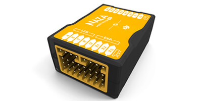
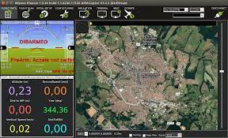
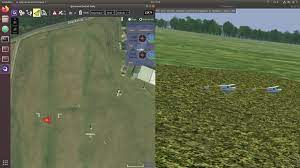

# Introduction

Hello. I'm Jaehyung, learning Drone & Deep learning 

In this course, we will install **ubuntu 18.04**, **ROS**, **MAVROS**, **Gazebo** to learn about Drone\_autopilot\_system

We also need some hardware and software \(such as **Pixhawk**, **Ardupilot** or **PX4**\) in system.

## **What is ROS?**

ROS is an open-source, meta-operating system for your robot. It provides the services you would expect from an operating system, including hardware abstraction, low-level device control, implementation of commonly-used functionality, message-passing between processes, and package management. It also provides tools and libraries for obtaining, building, writing, and running code across multiple computers.

We will learn more details of ROS\(such as ROS - node, topic, msg...\) in the page of ROS

## What is MAVROS?

MAVROS provides communication driver for various autopilots with MAVLink communication protocol. Additional it provides UDP MAVLink bridge for GCS\(ground control station\)

MAVROS develeops a node operating in ROS using of MAVLink protocol.

We will learn more details of MAVROS\(such as node, plugins, connection URL\) in the page of MAVROS

## What is Gazebo?

Gazebo is an open-source 3D robotics simulator.

We need Gazebo Simulator when simulates in \*SITL

> \*SITL :  Software in the loop. We can simulate without hardware with virtual environment.

## What hardware & software do we use?

### **There is FC Hardware such as Pixhawk, ARM, NAZA.**




Firmware of ARM is based on Ardupilot, produced in 3DR

Pixhawk  applies PX4\(hosted by Dronecode\), Ardupilot\(by 3DR\)

User can build or edit Firmware directly, so it has high extensibility

We will use Pixhawk for our FC for the reason of compatibility




Firmware of ARM is open-source based Ardupilot, produced in 3DR

Like Pixhawk, User can build or edit Firmware directly so it has high extensibility




NAZA is produced in DJI which is the largest drone producing company

NAZA has high stability and easy setup using a DJI program.

But firmware is not open-source, so it has lower extensibility



### **There is Software such as PX4, Ardupilot, MissionPlanner, QGroundControl**

Before install Firmware\(PX4, Ardupilot\) in FC, we need software\(Mission Planner, QGroundControl\) to run it.


Mission Planner & QGroundControl is GCS\(Ground control Station\) that enable Pixhawk to install Firmware\(PX4, Ardupilot\)


Then, what is firmware? : Firmware is a specific class of computer software that provides the low-level control for a device's specific hardware.




PX4 autopilot is an open-source autopilot system oriented toward inexpensive autonomous aircraft.

PX4 is an navigating software installed in Pixhawk

PX4 applys many flight simulators such as **Gazebo**, Flightgear, JSBSim, jMAVSim, AirSim

We will choose Gazebo as an Simulator, and there are two ways of simulating : SITL, HITL




ArduinoPilot is an open source software for remote control or automation of software-operated devices such as unmanned vehicles and drones.

Ardupilot can be installe in Pixhawk, it navigates the vehicle.




Mission Planner is open-source based software.

It applies korean, but it can be only used in Windows OS.




QGroundControl can install firmware PX4 or Ardupilot on the FC of the Pixhawk.

QGC is open source based and has copyright cc4.0\(cc4.0 : Users don't need to publish the source even when they build, modify, develop and distribute for commercial use\)

Although QGC also applys Ardupilot, it is recommended to use PX4 with QGC.

If you want to use Ardupilot, it is recommended to use Mission Planner.



