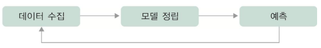
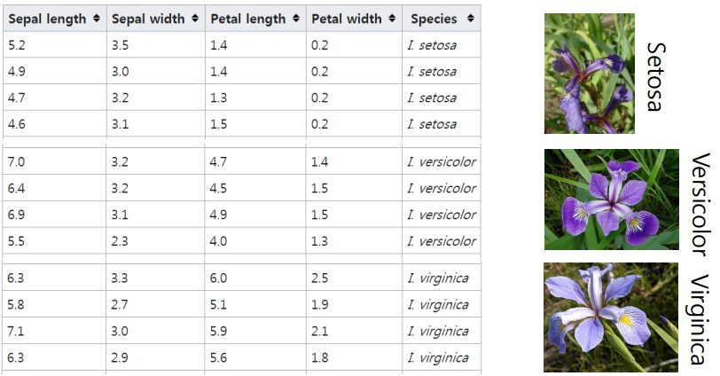
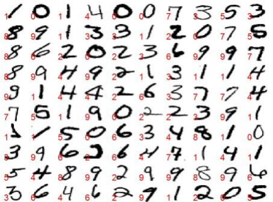
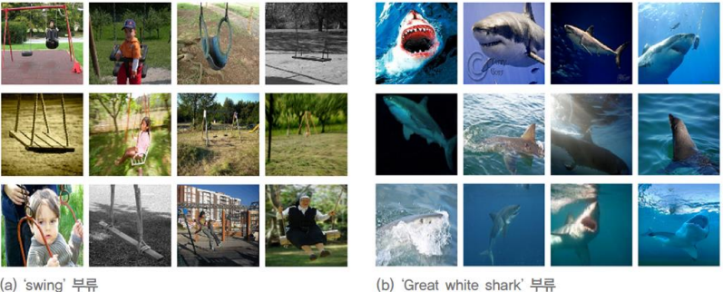
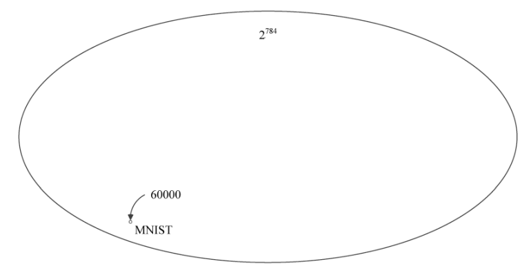
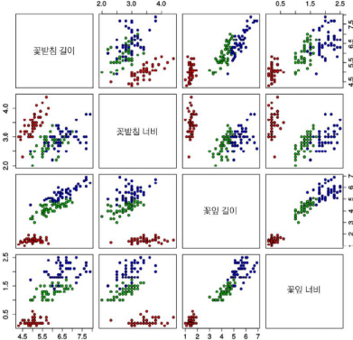

# 1.3 데이터의 이해

## 과학기술의 발달 과정

1. 데이터 수집
    - 현상 관측, 객관화 하여 기록
2. 모델정립
    - 수집한 데이터를 토대로 모델을 알아내는 과정
3. 예측
    - 정확도에 따라 1번 과정부터 수행

  
  
## 기계학습

- 기계학습이 다루는 문제는 과학기술과 다르게 단순한 수학 공식/글로 표현 불가
- 자동으로 모델을 찾아내는 과정이 필요
  - 모델링 과정의 자동화

# 1.3.1 기계학습에 사용되는 데이터의 특성

### 데이터 생성 과정(입력에 따른 출력이 나오는 과정)이 불분명하고 복잡하다

&rarr; 기계학습을 통해 데이터 생성모델을 근사 추정한 예측 모델을 구한다
- 데이터 생성 모델
  - 현실에서 데이터가 생성될때 따르는 규칙, 모델
- 예측모델
  - 컴퓨터가 훈련 집합을 가지고 데이터 생성모델을 근사하여 만든 모델

## &nbsp; &rarr; 예측 모델의 정확도가 높아지는 방향으로 학습

# 1.3.2 데이터의 품질

- 훈련 집합이 실제로 존재할 수 있는 샘플과 유사할수록 추정 정확도 향상
  - 얼굴인식 모델의 경우 훈련 모델로 정면사진, 측면사진등의 다양한 경우의 수들을 포함해야 한다
- 공개 데이터 베이스를 사용하면 높은 품질의 데이터 셋을 쉽게 구할 수 있다

|데이터 베이스 이름|설명|예제 사진|
|:---:|:---|:---:|
|Iris|붓꽃의 꽃받침 길이/넓이, 꽃잎 길이/넓이를 측정하여 기록한 데이터베이스 결과 값: 붓꽃 종 3종|
|MNIST|숫자 손글씨 데이터 베이스 0~9까지 숫자 손글씨 데이터를 제공|
|ImageNet|정보검색분야 WordNet의 단어마다 수백, 수천개의 영상 데이터를 제공하고 14,197,122개의 영상을 21,841개의 단어로 분류|

# 1.3.3 차원의 저주

- 인간이 만든 데이터베이스는 특징공간에서 매우 작은 부분을 차지
- 아래 사진과 같이 방대한 특징공간에서 실제 입력으로 들어올만한 데이터는 일부에 불과
  - MNIST 데이터 베이스의 경우 흑백 28*28비트맵의 경우 2284크기의 특징 공간을 갖는다
 
- 매니폴드 가정
  - 실제 데이터는 일정한 규칙에 따라 매끄럽게 변화
  - 이 특성을 기반으로 방대한 특징공간에 비해 적은 데이터만으로 높은 성능 달성 가능

# 1.3.4 데이터 가시화 방법

- 4차원 이상의 초공간 이상은 가시화 X(시각의 한계)
- 2개씩 조합하여 여러개 2차원 좌표평면 그래프로 가시화
  - 예시) Iris 데이터베이스의 경우

- 고차원 공간을 저차원으로 변환(6.6.1절)