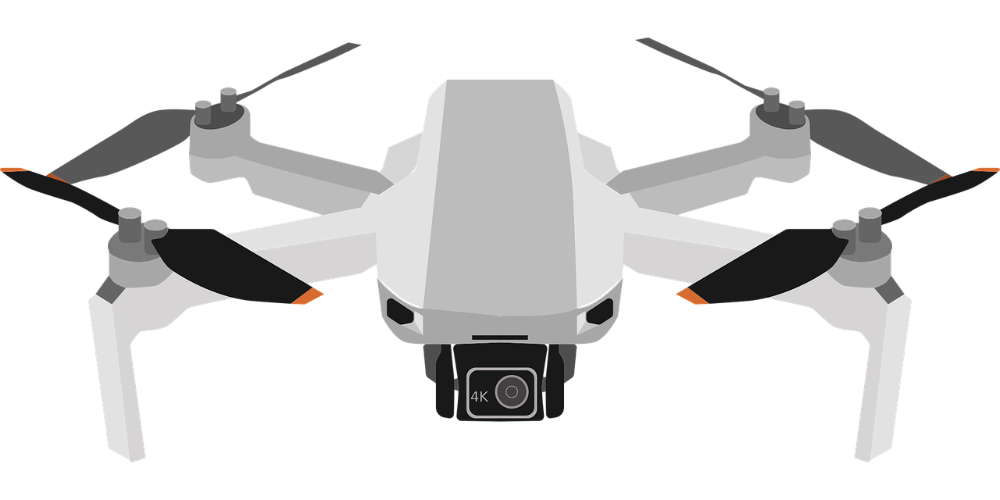
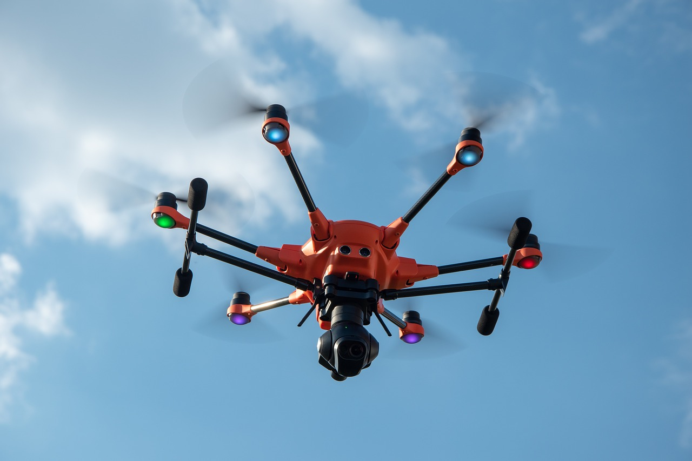
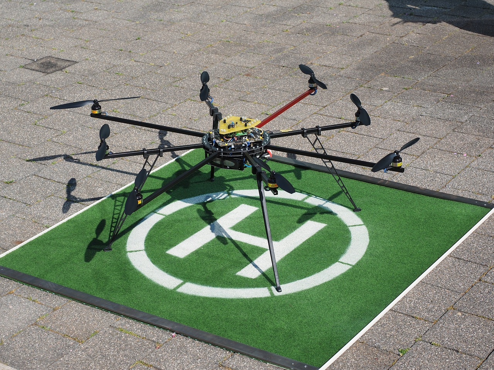
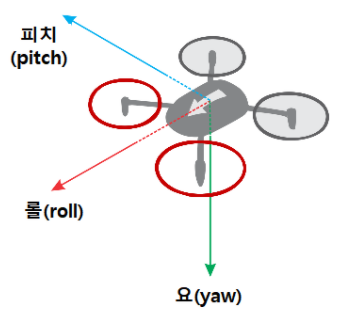
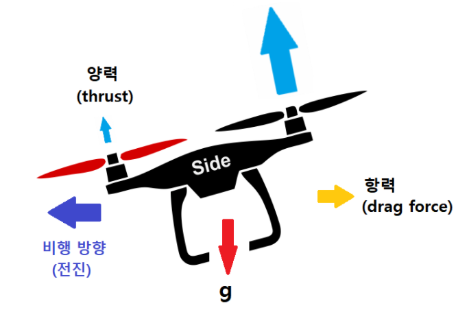

# Drone itself : Type & flight principle

## Type of Drone 

There many types of Drone such as Tri-copter, Quad-Copter, Penta-Copter, Hexa-Copter, Octo-Copter

Vehicles with odd-Rotor\(Tri, Penta\) are  not used well due to stability issues. So in this page, I won't cover them.

### **Quad-Copter**

#### **Quad-Copter**



The first image that comes to mind about drone is this quadcopter 

Each rotor is facing down, two rotating clockwise and two counterclockwise.

By adjusting the rotational speed of these rotors, you can control the movement of the quadcopter.

Its flight principles such as takeoff and landing, forward and backward and turn are covered below.

### **Hexa-Copter**




Hexa-Copter is a drone with 6 multi-rotors spreading at an angle of 60 degrees.

It flies on a similar principle as a quad-copter, but has higher lift and stability because it flies with six rotors

Even if there is a problem with the rotor during flight, it is possible to land safely with the remaining 5 rotors, so it is frequently used when expensive equipment is attached.

However, since it has 6 rotors, it has more power consumption and cost than quadcopter.

### **Octo-Copter**



Octo-Copter is a drone with 8 multi-rotors spreading at an angle of 45 degrees.

Since it has 8 rotors, it is more stable than a hexa**-**copter, but it consumes more power.

## Flight principles of Drone

### Components of Drone


Drone consists of **N motors**, **rotors**, **frame**, **FC**, **gyroscope** and **acceleration sensor**, **gimbal motor**, **LIDAR**, **communication module**, **battery**, and **camera**.

There are also drones that use GPS, but we are not going to use GPS because the purpose of drones is for autonomous driving.

This is because using GPS makes it difficult to recognize and avoid small objects such as wires or tree branches encountered during autonomous driving.

### Drone principal axes



####  Pitch <a id="pitch"></a>

Pitch is the axis in the horizontal plane perpendicular to the direction of flight.‌

#### Roll <a id="roll"></a>

Roll is an axis in a horizontal plane parallel to the direction of flight‌

#### Yaw <a id="yaw"></a>

The yaw is an axis in a vertical plane perpendicular to the direction of travel.


### Flight Principle

#### Take Off

```text
Need to modify
```

#### Landing

```text
Need to modify
```

#### Forward




