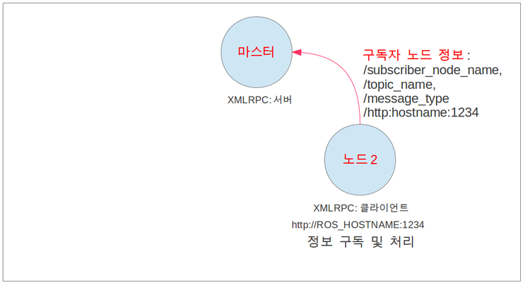
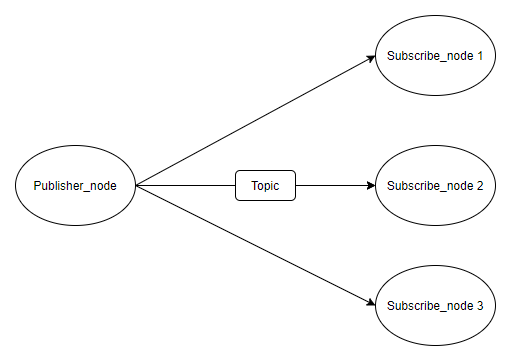
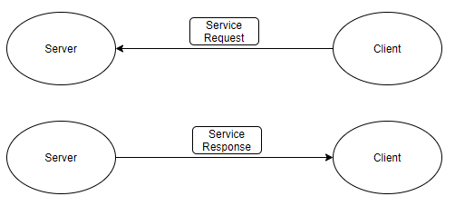
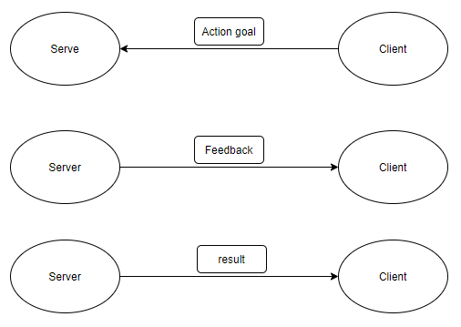

# ROS : robot operating system

## **Install ROS\_Melodic**

```text
will be edited later :D 
```

## ROS Topic

### What is ROS Topic?

Topic is a channel through which nodes can communicate. Some communication occurs between the two programs, and some messages are exchanged. This path is called '**topic**'.

If you do not understand from the explanation above, look at an example of using a topic in ROS and find out the role of the topic in the ROS Topic tutorial.

### ROS Topic tutorial

After installing ROS, enter **roscore** to run it.

```text
$ roscore
```

After roscore works fine, run **turtlesim**. \(Please run in a new terminal\)

```text
$ rosrun turtlesim turtlesim_node
```


Execute **teleop**, a node that will receive key input corresponding to turtlesim's direction control.\(in a new terminal\)

```text
$ rosrun turtlesim turtle_teleop_key
```

 


If you run teleop and operate it with the keyboard, the turtle summoned by the turtlesim node will move as shown in the picture above.

Now let's see what the topic played in the process of moving the turtle above.

turtlesim\_node and __turtle\_teleop\_key node communicates with ROS Topic.

turtle\_teleop_\__key node publishes the input of key on a topic, turtlesim node subscribes to the same topic to receive the input of key.

We can intuitively check **nodes** and **topics** through rqt\_graph.

#### Using rqt\_graph

rqt\_graph shows topics and nodes running in ros.

Enter the following command to run rqt\_graph

```text
$ sudo apt-get install ros-melodic-rqt
$ sudo apt-get install ros-melodic-rqt-common-plugins
```

Enter following command in a new terminal.

```text
$ rosrun rqt_graph rqt_graph
```

You can see a picture similar to the one below


In rqt_graph above, /teleopturtle and /turtlesim are nodes, and teleop publishes a topic named /turtle1/command_\_velocity. Then /turtlesim node subscribes the topic\(/turtle1/command\_velocity\) to get the input of key.

#### Introducing rostopic

You can get a lot of information about topics through the 'rostopic' command.

```text
$ rostopic -h
```

```text
rostopic bw     display bandwidth used by topic
rostopic echo   print messages to screen
rostopic hz     display publishing rate of topic    
rostopic list   print information about active topics
rostopic pub    publish data to topic
rostopic type   print topic type
```

#### Using rostopic list


rostopic list returns a list of all topics currently subscribed or published.

```text
$ rostopic list -h
```

```text
Usage: rostopic list [/topic]

Options:
  -h, --help            show this help message and exit
  -b BAGFILE, --bag=BAGFILE
                        list topics in .bag file
  -v, --verbose         list full details about each topic
  -p                    list only publishers
  -s                    list only subscribers
```

Command rostopic list can use option 'verbose'\("-v"\)

```text
$ rostopic list -v
```

With that, you can see where the topic is published, where it is subscribed, and the type of topic.

```text
Published topics:
 * /turtle1/color_sensor [turtlesim/Color] 1 publisher
 * /turtle1/cmd_vel [geometry_msgs/Twist] 1 publisher
 * /rosout [rosgraph_msgs/Log] 2 publishers
 * /rosout_agg [rosgraph_msgs/Log] 1 publisher
 * /turtle1/pose [turtlesim/Pose] 1 publisher

Subscribed topics:
 * /turtle1/cmd_vel [geometry_msgs/Twist] 1 subscriber
 * /rosout [rosgraph_msgs/Log] 1 subscriber
```

For more information or ROS Topic tutorials, check out:  [ROS Topic Tutorial](http://wiki.ros.org/ko/ROS/Tutorials/UnderstandingTopics) 

Source of above tutorial : [http://wiki.ros.org/ko/ROS/Tutorials/UnderstandingTopics](http://wiki.ros.org/ko/ROS/Tutorials/UnderstandingTopics)

## ROS Message

Communication on topics happens by transmitting ROS messages between nodes.

For the publisher \(turtle\_teleop\_key\) and subscriber \(turtlesim\_node\) to communicate, the publisher and subscriber must send and receive the same type of message.

This means that a topic type is defined by the message type published on it. The type of the message sent on a topic can be determined using rostopic type.

Data is exchanged between nodes through messages. Messages are in the form of variables such as integers, floating points, and booleans.


In the picture above, suppose that node 1 is a publish node and node 2 is a subscribe node.

After node1 and node2 are connected to the master node, node1 publishes msg on a topic and delivers information to node2\(subscribe node\)

For detailed information related to the node, such as the communication order between the node and the  master node, see the ROS Node Table of Contents.

### Using rostopic type

rostopic type returns the message type of any topic being published. Enter below command.

```text
$ rostopic type /turtle1/cmd_vel
```

Then you can see

```text
geometry_msgs/Twist
```

We can look at the details of the message using rosmsg:

```text
$ rosmsg show geometry_msgs/Twist
```

```text
geometry_msgs/Vector3 linear
  float64 x
  float64 y
  float64 z
geometry_msgs/Vector3 angular
  float64 x
  float64 y
  float64 z
```

## ROS Node

ROS node is an executable file of ROS package. ROS node communicates with other nodes using the ROS client library.

Also, a node can provide or use a service on a topic.

Let's see the concept of of Node through the practice process of roscore and node\(rosrun, roslaunch\).

**1\) Run the master\_node**

```text
 roscore
```


With the command "roscore", run master\_node

For node-to-node access, the master registers the names of nodes, the name of the topic and service, the message type, the URI address, and the port, and informs other nodes of this information when requested.


**2\) Run the subscribe node**

 You can run subscribe node with the command "rosrun" or "roslaunch"

```text
 rosrun "package_name node_name"
```

```text
 roslaunch "package_name launch_name"
```



When subscribe\_node run after the command input, it register it's name of node, name of topic, type of message, adress of URI & port.

Master node communicates with other nodes through \*XMLRPC

\*XMLRPC is a kind of RPC protocol. We don't need to understand the principles of XMLRPC in detail.    Just know that the master node communicates with the general node through XMLRPC.

**3\) Run the publish\_node**

Run the publish\_node with the command "rosrun" or "roslaunch".


When publish\_node run after the command input, it register it's name of node, name of topic, type of message, adress of URI or port to master\_node.

**4 \) Master node inform about publish\_node to Subscribe\_node**


Master node send information\(/name of node, /name of topic, /type of message, /adress of URI & port\) about publish\_node to Subscribe\_node.

**5 \) Subscibe node requests connection to Publish node** 


Subscribe node requests connection to publish node with information\(/name of node, /name of topic, /type of message, /adress of URI & port\)

After publish node get the request, publish node respond with information of node.

Then subscribe node make a client about publish node to connect with publish node.


After subscribe node is connected to publish node, publish node send message on topic to subscribe node.

## ROS message communication

There are many ways to communicate between nodes in ROS system.

Let's see the differences between them.

### **1\) ROS Topic**

* One-way, asynchronous communication
* Publisher : message send, Subscriber : message reception
* communication way : \(1:n, 1:1, n:1, n:n\) 



\*\*\*\*

### **2\) ROS Service**

*  Two-way, synchronous communication
*  Communicate between service server, service client
*  Server responds only when there is a client request
*   Node disconnected when request and response are disconnected



\*\*\*\*

### **3\) ROS Action**

*  Two-way, asynchronous communication
*  Use if feedback is needed during request.
*  Type of message communication is asynchronomous, similar to the topic.



